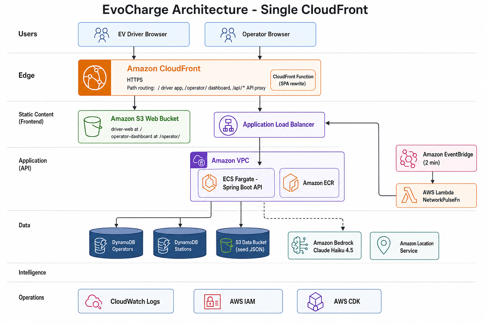
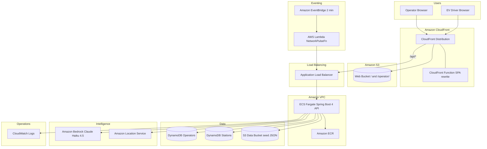

# EvoCharge Architecture

## Overview

EvoCharge is a cloud-native EV charging intelligence platform that aggregates data from multiple Nigerian charging operators into a unified API and two web applications, all served from one CloudFront URL.

**Live:** https://d8061ggv2y910.cloudfront.net/

## Architecture Diagram

*Single CloudFront distribution: driver app at `/`, operator dashboard at `/operator/`, API at `/api/*`.*

## Request Flow

1. **Static pages** — Browser requests `/` or `/operator/`. CloudFront serves React builds from S3. A CloudFront Function rewrites `/operator/` to `index.html` for client-side routing.
2. **API calls** — Browser calls `/api/v1/...` on the same domain. CloudFront proxies to the ALB with caching disabled. ALB routes to a healthy Fargate task.
3. **Data** — API reads operators and stations from DynamoDB. On first boot, seed JSON from the S3 data bucket is loaded into DynamoDB.
4. **Recommendations** — EvoScore ranks stations by distance, availability, wait, reliability, and connector match.
5. **AI advisor** — API invokes Amazon Bedrock (`anthropic.claude-haiku-4-5-20251001-v1:0`) with the user query and top station context. A fallback answer is returned if Bedrock is unavailable.
6. **Network Pulse** — EventBridge triggers Lambda every two minutes. The API rotates station statuses and pushes SSE events to connected driver clients.
7. **Map** — Driver app renders MapLibre tiles from Amazon Location Service.

## CDK Stacks

| Stack | Resources |
|-------|-----------|
| EvoCharge-Network | VPC, 2 AZs, public/private subnets, 1 NAT Gateway |
| EvoCharge-Data | DynamoDB Operators + Stations tables, S3 data bucket |
| EvoCharge-Api | ECR, ECS Fargate, ALB, EventBridge rule, Lambda, CloudWatch log group |
| EvoCharge-Web | S3 web bucket, CloudFront distribution, CloudFront Function |

## Path Routing (single distribution)

| CloudFront path | Origin | Purpose |
|-----------------|--------|---------|
| `/` (default) | S3 web bucket | Driver React app |
| `/operator/*` | S3 web bucket | Operator React app |
| `/api/*` | ALB (HTTP :80) | Spring Boot API |

## Tagging

Compulsory (all resources):

- `aws-apn-id` = `pc:8l8gcn23lmlgammd8572tk6va`
- `event` = `oneWithAI`

Gen AI (Api stack, Bedrock):

- `aws-apn-id` = `pc:a8xnp70u5w0s41039u52e6iuj`

Additional: `project`, `environment`, `managed-by`
